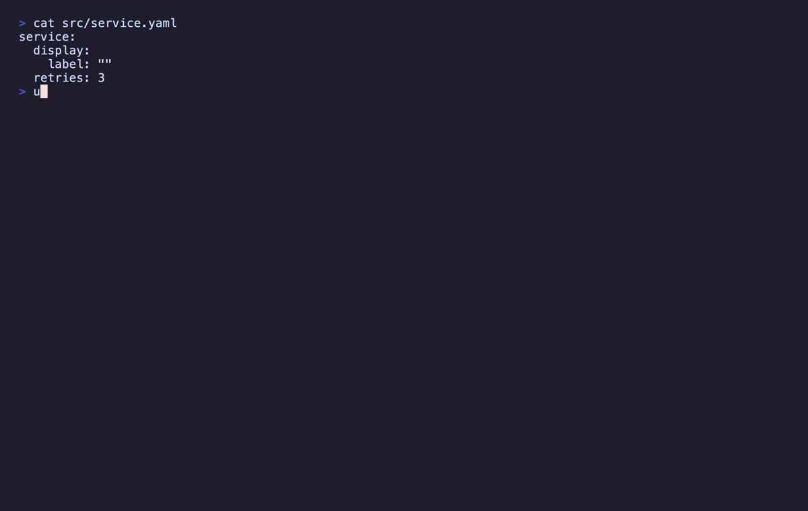

<p align="center">
  
</p>
<h1 align="center">Unicode-LE: The Characters That Are Not What They Look Like</h1>
<p align="center">
  <b>Find the Unicode that hides meaning in the current file or the whole workspace</b><br/>
  <i>Bidi controls, invisibles, homoglyphs, mixed scripts, non-NFC text, spaces that are not the space</i>
</p>

<p align="center">
  <a href="https://marketplace.visualstudio.com/items?itemName=nolindnaidoo.unicode-le">
    
  </a>
  <a href="https://open-vsx.org/extension/nolindnaidoo/unicode-le">
    
  </a>
  <a href="https://www.npmjs.com/package/unicode-le-mcp">
    
  </a>
  <a href="https://crates.io/crates/unicode-le">
    
  </a>
  <a href="https://letools.dev/tools/unicode-le">
    
  </a>
</p>

---

> **Useful?** A star or rating is how other developers find it —
> [★ GitHub](https://github.com/nolindnaidoo/unicode-le) ·
> [★ Open VSX](https://open-vsx.org/extension/nolindnaidoo/unicode-le/reviews) ·
> [★ Marketplace](https://marketplace.visualstudio.com/items?itemName=nolindnaidoo.unicode-le&ssr=false#review-details)

## What it does

Open a file, press `Ctrl+Alt+G` (`Cmd+Alt+G` on Mac), and every character in it that is not what it looks like lands in a report beside the editor: the bidirectional controls behind CVE-2021-42574, zero-width and other invisibles, homoglyphs, words no single script accounts for, lines that are not in Normalization Form C, spaces that are not U+0020, and codepoints with no agreed meaning. **Scan Workspace** does the same for every file on disk. Works in VS Code and in VS Code–based editors like Cursor and VSCodium (installable from Open VSX).

- **Review a pull request for Trojan Source** — a right-to-left override that makes the code a reviewer reads differ from the code that runs
- **Screen for forged names** — a Cyrillic `а` in an otherwise Latin `pаypal` is a finding; a word written wholly in Cyrillic is not
- **Explain the string that never matches** — a zero-width space or a decomposed `é` between two values a hash calls different and a person calls identical

**The report never contains a character it found.** Every finding is written as `U+202E`, never as the character itself, and a file path or key path from the document is escaped to `‮`. A report that pasted one raw would reorder the screen of whoever read it, and the tool would become the delivery mechanism for the thing it detects. **It rewrites nothing**: not a normalization, not a stripped space.

## Install

| Where | What you get | Install |
|---|---|---|
| **VS Code** | The screen, in your editor, on a keystroke | [Marketplace](https://marketplace.visualstudio.com/items?itemName=nolindnaidoo.unicode-le) |
| **Cursor, VSCodium, Windsurf** | The same extension | [Open VSX](https://open-vsx.org/extension/nolindnaidoo/unicode-le) |
| **A terminal or a CI step** | The same screen over a whole tree, with exit codes | `cargo install unicode-le` · [crates.io](https://crates.io/crates/unicode-le) |
| **Any MCP agent, via Node** | `detect_unicode_risks` over stdio | `npx unicode-le-mcp` · [npm](https://www.npmjs.com/package/unicode-le-mcp) |
| **Zed** | The MCP server as a context server | [add it by hand](https://zed.dev/docs/ai/mcp) *(no listing yet)* |

## Use it from an AI agent

The same engine runs as an [MCP](https://modelcontextprotocol.io) server, so an agent can call it directly instead of you running a command. It matters more here than for most tools: a model that pasted a document into its own reasoning has already been handed the bidi controls in it, and what comes back from this server is `U+XXXX` and English, so the answer cannot carry them on into a commit message or a review comment.

| Editor | How |
|---|---|
| **VS Code** 1.101+ | Nothing to install — the extension registers `detect_unicode_risks` with agent mode |
| **Zed** | No listing yet — [add the MCP server by hand](https://zed.dev/docs/ai/mcp) |
| **Claude Code** | `claude mcp add unicode-le -- npx -y unicode-le-mcp` |
| **Cursor, Windsurf, anything else** | point it at `npx unicode-le-mcp` |

```
detect_unicode_risks(content, kinds?, scripts?, format?, filename?, maxResults?)
```

Returns each finding with its kind, severity, 1-based line and column (UTF-16, as an editor counts), byte offset, the codepoints, the script and, where the format allows, the key path it sits under — plus any refusal, both structured and as a warning, so an empty finding list is never mistaken for a clean document. Every non-ASCII character in a reply leaves as `\uXXXX`. Capped at 500 by default with `meta.truncated`.

The server takes content and returns data — it reads no files and makes no network requests of its own. Published as [`unicode-le-mcp`](https://www.npmjs.com/package/unicode-le-mcp) on npm and as `io.github.nolindnaidoo/unicode-le` in the [MCP registry](https://registry.modelcontextprotocol.io). It answers exactly as the Rust CLI's server does: one corpus runs against both, a differential test feeds both thousands of generated documents, and both read the same Unicode tables — written out by the crate — rather than whatever version the host's JavaScript engine carries.

<details>
<summary><b>Configuring it by hand</b> — any host with an MCP config file</summary>

```json
{
  "mcpServers": {
    "unicode-le": {
      "command": "npx",
      "args": ["-y", "unicode-le-mcp"]
    }
  }
}
```

Or install it once with `npm install -g unicode-le-mcp` and point at `unicode-le-mcp`. It needs no environment variables, no API key and no configuration of its own. To check it:

```bash
echo '{"jsonrpc":"2.0","id":1,"method":"tools/list"}' | npx -y unicode-le-mcp
```

</details>

## What it finds

| Kind | Severity | What |
|---|---|---|
| `bidi-control` | high | U+202A–U+202E, U+2066–U+2069, U+061C — the Trojan Source class. They reorder how the rest of the line renders. |
| `confusable` | high | A homoglyph in a word of another script, or a compatibility form of an ASCII character (full-width `Ｆ`, mathematical `𝐚`, the Kelvin sign), with the codepoint it resembles |
| `mixed-script` | high | One word that no single script accounts for |
| `invisible` | medium | Zero-width characters, the soft hyphen, and U+FEFF anywhere but the first byte |
| `unassigned-or-private-use` | medium | A codepoint with no assigned meaning: private use, unassigned, a noncharacter |
| `non-nfc` | low | A line that is not in Normalization Form C. Reported, never rewritten |
| `unusual-whitespace` | low | A space that is not U+0020: no-break, ideographic, the en and em spaces |

## It runs on translated code without drowning you

A naive confusable check flags every letter of every Russian and Chinese string in a workspace — thousands of findings on exactly the codebases that most need the check, so it gets switched off, and the Trojan Source screen goes off with it.

- **A word is judged, never a file.** `Привет` is wholly Cyrillic and is Russian. Japanese mixes Han, Hiragana and Katakana in one word constantly, and UTS #39 knows that is Japanese.
- **A file plainly written in another script is not judged for homoglyphs**, and the report says so — at least 10% of its letters in a script nobody declared. Every other check still runs on it.
- **Declaring a script turns the check on, never off.** Name your workspace's scripts in `unicode-le.detection.scripts` — `Han`, `Cyrillic`, `Hira` — and a Latin product name inside a Chinese string is a translation, while a Cyrillic letter in a Latin word in the same file is still caught.

## It says where in the document, not just where in the file

In JSON, YAML, TOML, INI and `.properties`, `.env`, CSV and TSV a finding also carries the key path it sits under — `metrics.headline.eyebrow` rather than line 412 of a five-thousand-line catalogue. **The format never decides whether a finding exists**, only how it is addressed: a file whose format cannot be parsed is still scanned and still reports everything in it.

## It refuses rather than guessing

The workspace scan reads every file as bytes. A UTF-16 or UTF-32 file, a binary file and a file that is not valid UTF-8 are **refused by name** rather than decoded as something else, because a wrong decode invents findings: read UTF-16 as UTF-8 and every second byte becomes an invisible character that is not in the file.

## The CLI

The same screen runs from a terminal or a CI step: a Rust CLI in [`crate/`](crate/README.md), sharing one corpus with the extension — [`crate/fixtures/`](crate/fixtures/) — so the two can never read a document differently.

<p align="center">
  
</p>

```bash
unicode-le .                          # every finding in the tree, as JSON on stdout
unicode-le --fail-on bidi .           # in CI, for the CVE and nothing else
unicode-le --script Han,Cyrillic src/ # a translated tree, judged rather than refused
unicode-le mcp                        # the same screen over MCP on stdio
```

**Exit codes are the API** — 0 clean, 1 a finding `--fail-on` counts, 2 the question was malformed (or `--strict` with any refusal).

## Commands

| Command | Description |
|---|---|
| `Unicode-LE: Detect Unicode Risks` (`Ctrl+Alt+G` / `Cmd+Alt+G`) | Screen the active document, as the editor holds it |
| `Unicode-LE: Scan Workspace for Unicode Risks` | Screen every file matched by `workspace.scanPatterns`, read from disk as UTF-8 |
| `Unicode-LE: Open Settings` | Open Unicode-LE settings |
| `Unicode-LE: Help & Troubleshooting` | Built-in documentation |

## Settings

| Setting | Default | Description |
|---|---|---|
| `unicode-le.detection.kinds` | `[]` | Report only these kinds; empty is every kind, the only setting under which an empty report means clean |
| `unicode-le.detection.scripts` | `[]` | Non-Latin scripts your files are written in, by Unicode name or ISO 15924 tag |
| `unicode-le.openResultsSideBySide` | `true` | Open the report beside the current editor |
| `unicode-le.copyToClipboardEnabled` | `false` | Also copy the report to the clipboard |
| `unicode-le.workspace.scanPatterns` | `["**/*"]` | Glob patterns of the files the workspace scan reads |
| `unicode-le.workspace.scanExcludes` | `node_modules`, `.git`, `dist`, `build`, `target`, `*.min.js` | Glob patterns the workspace scan skips |
| `unicode-le.workspace.scanMaxFiles` | `5000` | The most files one workspace scan reads |
| `unicode-le.notificationsLevel` | `silent` | `all` = every notification, `important` = warnings + errors, `silent` = errors only |
| `unicode-le.safety.enabled` | `true` | Guardrails for large files |
| `unicode-le.safety.fileSizeWarnBytes` | `1000000` | Warn about a larger active document; leave larger workspace files unread |
| `unicode-le.statusBar.enabled` | `true` | Show the status bar item |
| `unicode-le.telemetryEnabled` | `false` | Local-only event log (see Privacy) |

## Languages

Twelve languages besides English:

German · Spanish · French · Indonesian · Italian · Japanese · Korean ·
Portuguese (Brazil) · Russian · Ukrainian · Vietnamese · Chinese (Simplified)

Both halves are covered — the manifest (command titles, setting names and descriptions) and everything shown while the extension runs (notifications, the status bar and the report's headings). Each finding's detail is the engine's English, identical to the CLI's and the MCP server's.

## Privacy & security

- **No network access.** The extension never sends data anywhere. The `telemetryEnabled` setting only writes events to a local Output Channel you can inspect (`Unicode-LE`).
- **The MCP server holds the same line.** It takes content as an argument and returns data: no filesystem access, no network calls, no telemetry. `check:mcp-bundle` fails the build if the server writes a non-ASCII character to stdout.
- Error notifications redact home directories and credential-shaped fragments.

## Documentation

| What | Where |
|---|---|
| What the tool is allowed to say — scope, output contract, refusals, non-goals | [`crate/SPEC.md`](crate/SPEC.md) |
| How the extension is built and held together — architecture, invariants, toolchain, release | [AGENTS.md](AGENTS.md) |
| How the CLI is built and held together | [`crate/AGENTS.md`](crate/AGENTS.md) |
| What changed | [CHANGELOG.md](CHANGELOG.md) · [`crate/CHANGELOG.md`](crate/CHANGELOG.md) |
| The tool's page, and the other fifteen | [letools.dev/tools/unicode-le](https://letools.dev/tools/unicode-le) |

## Performance

<!-- performance:start -->
| Input | Size | Found | Time | Rate | Scan speed |
| --- | --- | --- | --- | --- | --- |
| Source with hazards | 1.16 MB | 1,800 | 160.71 ms | 11,200/sec | 7.2 MB/s |
| JSON catalogue | 1.46 MB | 20,000 | 195.09 ms | 102,518/sec | 7.5 MB/s |
| Minified one-liner | 0.63 MB | 40,000 | 78.7 ms | 508,247/sec | 8 MB/s |

Median of 7 runs after warmup, on Apple M5 Pro, 24 GB RAM, Node 24.3.0. Inputs are generated
by `scripts/benchmark.ts` rather than checked in, so the sizes above are
exactly what was measured. Reproduce with `bun run benchmark`.

These are machine-specific and are not asserted in CI — a benchmark that gates
a build only tells you how busy the runner was.
<!-- performance:end -->

## Testing

<!-- coverage:start -->
| Metric | Coverage |
| --- | --- |
| Statements | 86.92% |
| Branches | 78.26% |
| Functions | 94.58% |
| Lines | 88.77% |

117 test cases across 11 files, plus an integration suite that runs
in a real VS Code extension host and an end-to-end test that installs the
built `.vsix` into a clean profile.

Generated from a real run — `coverage/coverage-summary.json` and
`coverage/test-results.json` — by `scripts/coverage-readme.js`; CI fails if
this section drifts. Reproduce with `bun run test:coverage`, and the case
count is the one vitest prints.
<!-- coverage:end -->

## More from the LE family

Sixteen single-purpose tools for the work in front of every model. Each ships
a Rust CLI and an MCP server. One page: **[letools.dev](https://letools.dev)**

**Get it out**

- **[String-LE](https://letools.dev/tools/string-le)** — Extract every string in a codebase, with its position, so a person can read them
- **[Numbers-LE](https://letools.dev/tools/numbers-le)** — Extract every hardcoded number in a codebase, so a person can check them
- **[Units-LE](https://letools.dev/tools/units-le)** — Extract every quantity with its unit, normalized, and refuse the ambiguous ones by name
- **[Dates-LE](https://letools.dev/tools/dates-le)** — Extract every date and timestamp, and the exact instant each one resolves to
- **[IDs-LE](https://letools.dev/tools/ids-le)** — Extract every UUID, ULID, NanoID, ObjectId and Snowflake, and decode the time inside
- **[IPs-LE](https://letools.dev/tools/ips-le)** — Extract every IP address, CIDR block and MAC, normalized and classified by scope
- **[URLs-LE](https://letools.dev/tools/urls-le)** — Extract every URL in a codebase, with its protocol and exact position
- **[Paths-LE](https://letools.dev/tools/paths-le)** — Extract every file path in a codebase, and say whether it still points at anything
- **[Colors-LE](https://letools.dev/tools/colors-le)** — Extract every color in a codebase, and say which ones are not in your palette

**Check it**

- **[Regex-LE](https://letools.dev/tools/regex-le)** — Find every regex in a codebase, and report which can be driven into catastrophic backtracking
- **[Versions-LE](https://letools.dev/tools/versions-le)** — Find where one dependency is constrained differently across a repository's manifests
- **[i18n-LE](https://letools.dev/tools/i18n-le)** — Identify the i18n library a project uses, then audit its catalogs by that library's rules
- **[Scrape-LE](https://letools.dev/tools/scrape-le)** — Check whether a page is scrapeable before the scraper is written, and say when it cannot tell

**Guard it**

- **[Secrets-LE](https://letools.dev/tools/secrets-le)** — Find hardcoded credentials in a codebase, and never print one into the report
- **[EnvSync-LE](https://letools.dev/tools/envsync-le)** — Compare the dotenv files in a tree, and say which keys are missing from which
- **[Unicode-LE](https://letools.dev/tools/unicode-le)** — Find the Unicode that hides meaning — bidi controls, invisibles, homoglyphs, mixed scripts

Each stands on its own: no shared crate, no published core. Where two of them
agree, it is because the same answer was right twice.

**Contact** — [nolindnaidoo.com](https://nolindnaidoo.com) · [GitHub](https://github.com/nolindnaidoo) · [LinkedIn](https://www.linkedin.com/in/nolindnaidoo/)

## Also by nolindnaidoo

**Rust** — pixelcoords and pixelactions are one loop: pixelcoords answers
*where*, pixelactions *acts* there. Their own tools, their own voice — not
part of the LE family.

- **[pixelcoords](https://github.com/nolindnaidoo/pixelcoords)** — Freeze your screen, mark regions, get pixel-exact coordinates and crops
  [pixelcoords.dev](https://pixelcoords.dev) · [crates.io](https://crates.io/crates/pixelcoords) · [docs.rs](https://docs.rs/pixelcoords)
- **[pixelactions](https://github.com/nolindnaidoo/pixelactions)** — Consume human-verified coordinates, perform the interaction, confirm it landed
  [pixelactions.dev](https://pixelactions.dev) · [crates.io](https://crates.io/crates/pixelactions) · [docs.rs](https://docs.rs/pixelactions)

## License

MIT © [nolindnaidoo](https://github.com/nolindnaidoo)
